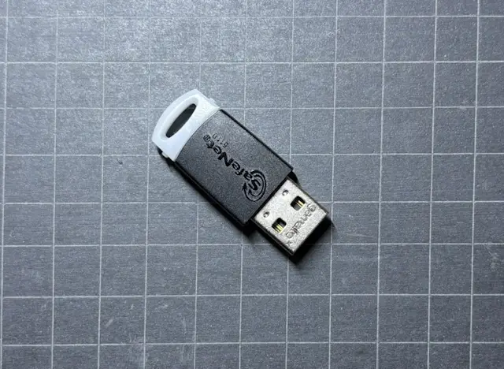
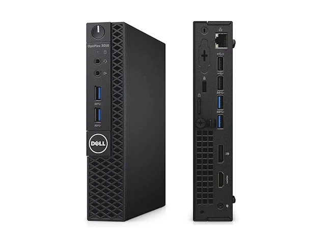

# Getting Started with Adhoc File Signer on Windows

This tutorial will guide you through the basic installation and configuration of
Adhoc File Signer on Windows.

## HSM

**HSM** abbreviation stands for _Hardware Security Module_.

Recently, the code signing industry has shifted toward the exclusive use of HSMs
for storing sensitive cryptographic material. If you obtain a code signing
certificate after 2022, it will likely be issued with an HSM device similar to the
one shown below:



Figure 1. SafeNet 5110 HSM with USB 2.0 interface

Each HSM is accompanied by client software. Once installed on Windows, this
software makes the corresponding code signing certificate available in the
**User Certificate Store**, which is managed by the operating system.

After the certificate is available in the store, any program on that machine can
use it to sign files.

But what if you operate multiple build servers distributed across the globe?
They all need access to the code signing certificate — yet the certificate is
only usable on the local machine where the HSM is physically connected.

To solve this challenge, you need software that securely exposes the signing
capability to authorized remote clients. This is exactly what **Adhoc File
Signer Server** does: it uses the locally available certificate to fulfill
client signing requests in a secure manner.

## Choosing a Host Machine

The HSM must be connected to a machine that will run Adhoc File Signer Server. A
convenient option might be to use a virtual machine. However, support for USB
and HSM passthrough in virtualized environments is limited, and even when
available, it is often considered experimental without guarantees of actually
working.

For this reason, we recommend hosting Adhoc File Signer Server on physical
hardware. The software stack has modest requirements — a system with at least 2
CPU cores and 4 GB of RAM is sufficient.

In this guide, we will use a Dell microcomputer equipped with a 2C/4T 3.5 GHz
CPU and 8 GB of RAM:



Figure 2. Dell OptiPlex Micro 3050 computer

This model also includes a built-in TPM 2.0 module, which will be used to enable
drive encryption after the operating system installation, enhancing overall
system security.

## Operating System Configuration

We will use **Windows Server 2025** as the operating system for this setup.

After installation, BitLocker drive encryption should be enabled on the system
drive (`C:\`) to protect data at rest. This step is essential to prevent
unauthorized reuse of the HSM in the event of device theft.

To run Adhoc File Signer Server, it is strongly recommended to use a dedicated
user account. This minimizes the risk of interference with the HSM auto-logon
process which will be discussed later. We create a new user account named
`AppServer`, with no administrative privileges, intended primarily for running
unattended services.

## Software Prerequisites

The following software packages should be installed using an account with administrative privileges:

- [GNU-TK](https://github.com/gapotchenko/gnu-tk) — provides seamless POSIX environment needed by the server. Use MSI installation method to install GNU-TK on the server machine.
- [Windows SDK](https://developer.microsoft.com/en-us/windows/downloads/windows-sdk/) — provides `signtool` utility which is neccessary for signing files with Authenticode signature.
  This is the only SDK component that is required to be installed, other components are not needed by the server and thus are optional.

### Optional Components

- [NuGet](https://www.nuget.org/) — provides functionality for signing NuGet packages which are represented by `.nupkg` files.
  There are three ways to install NuGet:
     - It comes as integral part of [.NET SDK](https://dotnet.microsoft.com/en-us/download/dotnet)
     - Standalone executable file `nuget.exe` can be separately [downloaded](https://www.nuget.org/downloads) and placed at `C:\Server\usr\bin` directory (see below)
     - Via [winget](https://winget.run/pkg/Microsoft/NuGet) (installed per user, i.e. using `AppServer` account)
- [zstd](https://github.com/facebook/zstd) — provides more efficient data compression optimizing both speed and size.
  `zstd.exe` file can be placed at `C:\Server\usr\bin` directory.
  
## Adhoc File Signer Server Installation

The server software is available from the
[project releases page](https://github.com/gapotchenko/adhoc-file-signer/releases).
It is distributed as a portable archive:

```
adhoc-file-signer-X.Y.Z-server-portable.tar.gz
```

Once archive is downloaded, its contents should be unpacked to a dedicated
directory on the file system.

Let's prepare the directory. We start with a root directory that will contain
our app service(s):

```
C:\Server
```

We assign the `AppServer` user as the owner of the `C:\Server` directory. We
also can add other users and groups with corresponding permissions to ease the
administration.

Now, let's create an initial structure of the newly created directory according to
POSIX conventions:

- `C:\Server\bin` — contains executable files (control scripts in our case)
- `C:\Server\opt` — contains installable components
- `C:\Server\usr\bin` — contains 3rd party executable files

After that, we can extract the contents of
`adhoc-file-signer-X.Y.Z-server-portable.tar.gz` into
`C:\Server\opt\adhoc-file-signer` directory.

Now let's create a control script which orchestrates the app services. Create
`C:\Server\bin\run.sh` file with the following content (important: use `LF`
character as a new line separator in `.sh` files, not `CRLF`):

```sh
#!/bin/sh

set -eu

SCRIPT_DIR="$(dirname "$(readlink -fn -- "$0")")"
BASE_DIR="$(dirname "$SCRIPT_DIR")"
cd "$BASE_DIR"

export TERM=dumb
export NO_COLOR=true
export PATH="$PATH:$BASE_DIR/usr/bin"

opt/adhoc-file-signer/bin/adhoc-sign-server --host 127.0.0.1 2>&1
```

For now, everything this script does is configures the process environment and
passes control to `adhoc-sign-server` demanding it to bind to the IPv4 local
network interface `127.0.0.1`.

You may notice that we use a POSIX shell script in Windows which, at first, may
throw you into a loop. The reason we are doing so is to have a single codebase
for all supported operating systems. To rectify the mismatch between Windows and
POSIX environments, we rely on [GNU-TK](https://github.com/gapotchenko/gnu-tk).

Let's create a bridge script file `C:\Server\bin\run.bat` that will be
seamlessly executing its POSIX counterpart `C:\Server\bin\run.sh`:

```bat
@echo off
rem https://github.com/gapotchenko/gnu-tk
gnu-tk -i -x "%~dpn0.sh" %*
```

If we run `C:\Server\bin\run.bat` script now, we should get the following output:

```
adhoc-sign-server  Version X.Y.Z
Checking prerequisites...
Validating configuration...
adhoc-sign-server: GP_ADHOC_FILE_SIGNER_API environment variable is not set.
```

This happens because the configuration for `adhoc-sign-server` is yet to be provided.
